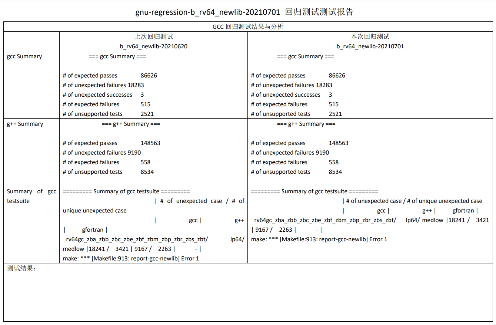
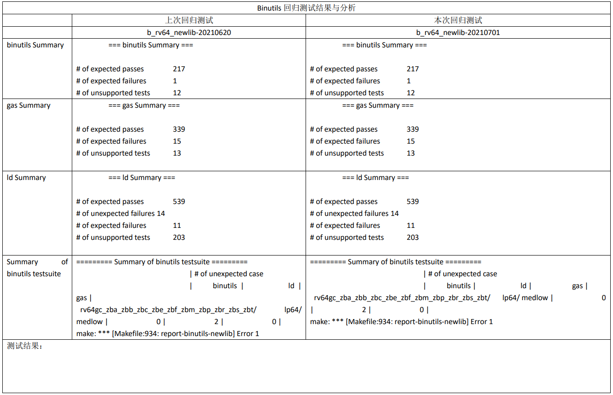

# gnu-regression-b_rv64_newlib

## 1. 测试说明

### 1.1. 测试目的

gnu回归测试，通过前后两次(代码提交前和代码提交后)回归测试结果的比对：

1. 验证之前版本产生的所有缺陷已全部被修复；

2. 确认修复这些缺陷没有引发新的缺陷。

   

### 1.2. 测试准备

#### 1、docker+ubuntu20.04准备

参考文档《搭建docker测试环境》，包含：

1. ubuntu20.04的搭建
2. 窗口会话分离的tmux会话
3. 新建一个普通用户并授权sudo
4. 最后切换到普通用户下执行本文档的测试操作


## 2. 测试步骤

### 2.1. 准备工作

#### 0、请按照【测试准备】步骤做好环境准备工作

#### 1、连接docker服务器

1. 远程连接服务器

   ```
   C:\Users\cz>ssh p9
   Welcome to Ubuntu 18.04.5 LTS (GNU/Linux 4.15.0-144-generic x86_64)
   
    * Documentation:  https://help.ubuntu.com
    * Management:     https://landscape.canonical.com
    * Support:        https://ubuntu.com/advantage
   New release '20.04.2 LTS' available.
   Run 'do-release-upgrade' to upgrade to it.
   
   
   Welcome to Alibaba Cloud Elastic Compute Service !
   
   Last login: Tue Jul  6 10:38:25 2021 from 111.196.246.16
   user@sshhost:~$
   ```

   请注意$符号前面的变化：用户名@机器人名

   

3. 查看所有的tmux会话

   ```
   # 显示所有会话
   user@sshhost:~$ tmux ls
   xj: 1 windows (created Mon Jun  7 10:06:04 2021) [157x85]
   ```

   

4.  连接之前建立的会话

   ```
   user@sshhost:~$ xijing@p9-plct:~$ tmux a -t xj
   #成功执行后，会进入到会话窗口（会话窗口最下面左下角显示[xj] 0:docker*   如下图绿色部分所示）
   ```

   

4. 检查当前用户是否为自定义用户

   检查命令行$符号前的用户和主机名信息，是否是自定义的用户名（**切记所有测试操作不要在root用户下执行**）。


### 2.2. 环境配置

#### 2、预装软件包

1. 普通用户下，sudo安装gnu测试工作所依赖的软件包。

   ```
   dockeruser@dockerhost:/$ sudo apt update
   
   dockeruser@dockerhost:/$ sudo apt upgrade
   
   dockeruser@dockerhost:/$ sudo apt install autoconf automake autotools-dev curl python3 libmpc-dev libmpfr-dev libgmp-dev gawk build-essential bison flex texinfo gperf libtool patchutils bc zlib1g-dev libexpat-dev cmake ninja-build pkg-config libglib2.0-dev libpixman-1-dev python git libfdt-dev libncurses5-dev libncursesw5-dev device-tree-compiler
   ```


2. 创建测试工作目录

   ```
   # 切换到home目录下
   dockeruser@dockerhost:/$ cd
   
   # 在home目录下创建新目录（如果是在/目录下创建新目录，会有权限问题）
   dockeruser@dockerhost:~$ mkdir RISCV
   dockeruser@dockerhost:~$  cd RISCV
   dockeruser@dockerhost:~/RISCV$ 
   ```


3. 记录测试环境信息

   ```
   #  ~/RISCV/b_rv64_newlib-task-20210701.log 用来记录测试环境、代码源、代码版本等信息
   dockeruser@dockerhost:~/RISCV$  cat /proc/version 2>&1|tee -a ~/RISCV/b_rv64_newlib-task-20210701.log
   dockeruser@dockerhost:~/RISCV$  uname -a 2>&1|tee -a ~/RISCV/b_rv64_newlib-task-20210701.log
   ```


#### 3、配置环境变量

根据规划的目录，配置环境变量：

   ```
# 配置环境变量
dockeruser@dockerhost:~$ vim ~/.bashrc
----在文件开头加入以下两行-------------
export RISCV=~/RISCV
export PATH=$RISCV/b_rv64_newlib/bin/:$PATH


# 使得环境变量生效
dockeruser@dockerhost:~$ source ~/.bashrc

# 检查是否生效
dockeruser@dockerhost:~$ echo $PATH 2>&1|tee -a ~/RISCV/b_rv64_newlib-task-20210701.log
/home/xijing/RISCV/b_rv64_newlib/bin/:/usr/local/sbin:/usr/local/bin:/usr/sbin:/usr/bin:/sbin:/bin:/usr/games:/usr/local/games:/snap/bin
dockeruser@dockerhost:~$ echo $RISCV 2>&1|tee -a ~/RISCV/b_rv64_newlib-task-20210701.log
/home/xijing/RISCV
   ```


### 2.3. 下载源码并构建

#### 4、下载riscv-gnu-toolchain代码，更新gcc、binutils-gdb子模块的B扩展代码（待测目标代码），并记录版本号

1. 下载riscv-gnu-toolchain总代码包，并查询记录其版本信息

```
   # git clone --recursive 用于循环克隆git子项目 
   dockeruser@dockerhost:~/RISCV$  git clone --recursive https://github.com/riscv/riscv-gnu-toolchain.git
```

   

2. 将代码拷贝一份重命名为b-ext（可选操作，当计划在同一台设备上测试多个分支时避免混淆）

   ```
   dockeruser@dockerhost:~/RISCV/riscv-gnu-toolchain$ cd ..
   dockeruser@dockerhost:~/RISCV$ cp riscv-gnu-toolchain b-ext
   dockeruser@dockerhost:~/RISCV$ cd b-ext
   
   # 查看并输出commmitid版本信息
   dockeruser@dockerhost:~/RISCV/b-ext$ git remote -v       2>&1|tee -a ~/RISCV/b_rv64_newlib-task-20210701.log
   dockeruser@dockerhost:~/RISCV/b-ext$ git branch  		   2>&1|tee -a ~/RISCV/b_rv64_newlib-task-20210701.log
   dockeruser@dockerhost:~/RISCV/b-ext$ git rev-parse HEAD  2>&1|tee -a ~/RISCV/b_rv64_newlib-task-20210701.log
   
   ```

   

3. 更新gcc子模块的代码为待测试代码

   ```
   dockeruser@dockerhost:~/RISCV/b-ext$ cd riscv-gcc
   
   # 添加一个远程仓库pz9115
   dockeruser@dockerhost:~/RISCV/b-ext/riscv-gcc$ git remote add pz9115 https://github.com/pz9115/riscv-gcc.git
   
   # 将远程仓库pz9115的最新内容拉到本地
   dockeruser@dockerhost:~/RISCV/b-ext/riscv-gcc$ git fetch pz9115
   remote: Enumerating objects: 1011, done.
   remote: Counting objects: 100% (999/999), done.
   remote: Compressing objects: 100% (303/303), done.
   remote: Total 1011 (delta 859), reused 778 (delta 680), pack-reused 12
   Receiving objects: 100% (1011/1011), 410.93 KiB | 5.96 MiB/s, done.
   Resolving deltas: 100% (859/859), completed with 39 local objects.
   From https://github.com/pz9115/riscv-gcc
    * [new branch]              BK                         -> pz9115/BK
    * [new branch]              k-dev                      -> pz9115/k-dev
    * [new branch]              p-ext-andes                -> pz9115/p-ext-andes
    * [new branch]              q-ext                      -> pz9115/q-ext
    * [new branch]              riscv-gcc-10.1.0-rvv       -> pz9115/riscv-gcc-10.1.0-rvv
    * [new branch]              riscv-gcc-10.1.0-rvv-zfh   -> pz9115/riscv-gcc-10.1.0-rvv-zfh
    * [new branch]              riscv-gcc-10.2.0-rvb       -> pz9115/riscv-gcc-10.2.0-rvb
    * [new branch]              riscv-gcc-10.2.0-zfinx     -> pz9115/riscv-gcc-10.2.0-zfinx
    * [new branch]              riscv-gcc-experiment-p-ext -> pz9115/riscv-gcc-experiment-p-ext
    
   #  checkout代码
   dockeruser@dockerhost:~/RISCV/b-ext/riscv-gcc$ git checkout pz9115/riscv-gcc-10.2.0-rvb
   Previous HEAD position was 03cb20e5433 Update 2 C++ coroutine testcases from upstream.
   HEAD is now at fcd1b5d046c Add testcases with for zbb zbe zbp
   
   # 查询riscv-gcc代码版本
   dockeruser@dockerhost:~/RISCV/b-ext/riscv-gcc$ git remote -v       2>&1|tee -a ~/RISCV/b_rv64_newlib-task-20210701.log
   dockeruser@dockerhost:~/RISCV/b-ext/riscv-gcc$ git branch  		 2>&1|tee -a ~/RISCV/b_rv64_newlib-task-20210701.log
   dockeruser@dockerhost:~/RISCV/b-ext/riscv-gcc$ git rev-parse HEAD  2>&1|tee -a ~/RISCV/b_rv64_newlib-task-20210701.log
   fcd1b5d046c6fb087a2dff83ca4cda3d28f10ed1   
   ```

   

4. 更新riscv-binutils代码包：

   ```
   dockeruser@dockerhost:~/RISCV/b-ext/riscv-gcc$ cd ../riscv-binutils/
   
   # 添加一个远程仓库pz9115
   dockeruser@dockerhost:~/RISCV/b-ext/riscv-binutils$ git remote add pz9115 https://github.com/pz9115/riscv-binutils-gdb.git
   
   # 将远程仓库pz9115的最新内容拉到本地
   dockeruser@dockerhost:~/RISCV/b-ext/riscv-binutils$  git fetch pz9115
   remote: Enumerating objects: 408, done.
   remote: Counting objects: 100% (393/393), done.
   remote: Compressing objects: 100% (129/129), done.
   remote: Total 408 (delta 307), reused 323 (delta 264), pack-reused 15
   Receiving objects: 100% (408/408), 481.07 KiB | 6.17 MiB/s, done.
   Resolving deltas: 100% (307/307), completed with 24 local objects.
   From https://github.com/pz9115/riscv-binutils-gdb
    * [new branch]            BK                              -> pz9115/BK
    * [new branch]            b-dev                           -> pz9115/b-dev
    * [new branch]            riscv-binutils-2.35-zfinx       -> pz9115/riscv-binutils-2.35-zfinx
    * [new branch]            riscv-binutils-2.36-k-ext       -> pz9115/riscv-binutils-2.36-k-ext
    * [new branch]            riscv-binutils-experiment       -> pz9115/riscv-binutils-experiment
    * [new branch]            riscv-binutils-experiment-p-ext -> pz9115/riscv-binutils-experiment-p-ext
    
   #  checkout代码
   dockeruser@dockerhost:~/RISCV/b-ext/riscv-binutils$ git checkout pz9115/riscv-binutils-experiment
   Previous HEAD position was f35674005e This is 2.36.1 release
   HEAD is now at d52e3ccf96 Fix the indents problems and update INSN_ALIAS FLAG
   
   # 查询并获取riscv-binutils版本信息
   dockeruser@dockerhost:~/RISCV/b-ext/riscv-binutils$ git remote -v       2>&1|tee -a ~/RISCV/b_rv64_newlib-task-20210701.log
   dockeruser@dockerhost:~/RISCV/b-ext/riscv-binutils$ git branch  		  2>&1|tee -a ~/RISCV/b_rv64_newlib-task-20210701.log
   dockeruser@dockerhost:~/RISCV/b-ext/riscv-binutils$ git rev-parse HEAD  2>&1|tee -a ~/RISCV/b_rv64_newlib-task-20210701.log
   d52e3ccf969016bd9db01a7e58e7902456d2c9e5      
   ```
   
   

#### 5、构建riscv-gnu-toolchain：newlib+rv64

1. 创建构建文件目录

   ```
   dockeruser@dockerhost:~/RISCV/b-ext/riscv-binutils$ cd ..
   dockeruser@dockerhost:~/RISCV/b-ext$ mkdir build_rv64_newlib
   dockeruser@dockerhost:~/RISCV/b-ext$ cd build_rv64_newlib
   ```

   

2. 用newlib库构建riscv64的目标文件

   ```
   # configure
   dockeruser@dockerhost:~/RISCV/b-ext/build_rv64_newlib$ ../configure --prefix=$RISCV/b_rv64_newlib/ --with-arch=rv64gc_zba_zbb_zbc_zbe_zbf_zbm_zbp_zbr_zbs_zbt --with-abi=lp64 --with-multilib-generator="rv64gc_zba_zbb_zbc_zbe_zbf_zbm_zbp_zbr_zbs_zbt-lp64--"
   checking for gcc... gcc
   checking whether the C compiler works... yes
   checking for C compiler default output file name... a.out
   checking for suffix of executables...
   checking whether we are cross compiling... no
   checking for suffix of object files... o
   checking whether we are using the GNU C compiler... yes
   checking whether gcc accepts -g... yes
   checking for gcc option to accept ISO C89... none needed
   checking for grep that handles long lines and -e... /usr/bin/grep
   checking for fgrep... /usr/bin/grep -F
   checking for grep that handles long lines and -e... (cached) /usr/bin/grep
   checking for bash... /bin/bash
   checking for __gmpz_init in -lgmp... yes
   checking for mpfr_init in -lmpfr... yes
   checking for mpc_init2 in -lmpc... yes
   checking for curl... /usr/bin/curl
   checking for wget... /usr/bin/wget
   checking for ftp... /usr/bin/ftp
   configure: creating ./config.status
   config.status: creating Makefile
   config.status: creating scripts/wrapper/awk/awk
   config.status: creating scripts/wrapper/sed/sed
   
   # 构建并将构建过程记录到log文档中，修改日期为实际测试日期
   dockeruser@dockerhost:~/RISCV/b-ext/build_rv64_newlib$ make 2>&1|tee b_rv64_newlib-build-20210701.log
   ```

   

### 2.4. 运行测试用例测试

#### 6、执行gcc回归测试

3. 运行gcc回归测试用例进行测试

   ```
   dockeruser@dockerhost:~/RISCV/b-ext/build_rv64_newlib$ make report-gcc-newlib 2>&1|tee b_rv64_newlib-reportgccnewlib-20210701.log
   ```

   

4. gcc回归测试预期结果

   当命令窗口输出停止刷新，并出现`========= Summary of gcc testsuite =========`表示回归测试已经执行完成。

   翻看输出的 b_rv64_newlib-reportgccnewlib-20210701.log文档，搜索Summary关键词，能够找到gcc Summary、 g++ Summary 、Summary of gcc testsuite 等信息。如下所示：

   
   
   ```
   		=== gcc Summary ===
   
   # of expected passes		86626
   # of unexpected failures	18283
   # of unexpected successes	3
   # of expected failures		515
   # of unsupported tests		2521
   
   		=== g++ Summary ===
   
   # of expected passes		148563
   # of unexpected failures	9190
   # of expected failures		558
   # of unsupported tests		8534
   
   
                  ========= Summary of gcc testsuite =========
                               | # of unexpected case / # of unique unexpected case
                               |          gcc |          g++ |     gfortran |
    rv64gc_zba_zbb_zbc_zbe_zbf_zbm_zbp_zbr_zbs_zbt/   lp64/ medlow |18241 /  3421 | 9167 /  2263 |      - |
   make: *** [Makefile:913: report-gcc-newlib] Error 1
   ```


#### 7、执行binutils回归测试

5.  运行binutils回归测试用例进行测试

   ```
   dockeruser@dockerhost:~/RISCV/b-ext/build_rv64_newlib$ make report-binutils-newlib 2>&1|tee b_rv64_newlib-reportbinutilsnewlib-20210701.log
   ```

   

6.  binutils回归测试预期结果

   当命令窗口输出停止刷新，并出现`========= Summary of binutils testsuite =========`表示回归测试已经执行完成。

   翻看输出的 b_rv64_newlib-reportbinutilsnewlib-20210701.log文档，搜索Summary关键词，能够找到binutils Summary、 gas Summary 、ld Summary 、Summary of gcc testsuite 等信息。如下所示：

   
   
   ```
   		=== binutils Summary ===
   
   # of expected passes		217
   # of expected failures		1
   # of unsupported tests		12
   
   		=== gas Summary ===
   
   # of expected passes		339
   # of expected failures		15
   # of unsupported tests		13
   
   		=== ld Summary ===
   
   # of expected passes		539
   # of unexpected failures	14
   # of expected failures		11
   # of unsupported tests		203
   
   
                  ========= Summary of binutils testsuite =========
                               | # of unexpected case
                               |     binutils |           ld |          gas |
    rv64gc_zba_zbb_zbc_zbe_zbf_zbm_zbp_zbr_zbs_zbt/   lp64/ medlow |            0 |            2 |            0 |
   make: *** [Makefile:934: report-binutils-newlib] Error 1
   ```
   


### 2.5. 测试结果管理

#### 8、上传测试结果日志

在整个测试过程中，我们记录了以下信息：

- 测试环境+测试目标和版本：~/RISCV/b_rv64_newlib-task-20210701.log
- 构建日志：b_rv64_newlib-build-20210701.log
- gcc回归测试结果：b_rv64_newlib-reportgccnewlib-20210701.log
- binutils回归测试结果：b_rv64_newlib-reportbinutilsnewlib-20210701.log

将上述回归测试生成的log文件上传到测试结果管理仓库。【暂定义测试结果保存到 https://github.com/xijing21/tarsier-testresult-gnu.git 】

   ```
dockeruser@dockerhost:~/RISCV$ git clone https://github.com/xijing21/tarsier-testresult-gnu.git
dockeruser@dockerhost:~/RISCV$ cd tarsier-testresult-gnu
dockeruser@dockerhost:~/RISCV/tarsier-testresult-gnu$ cp ~/RISCV/b-ext/build_rv64_newlib/*-20210701.log  .
dockeruser@dockerhost:~/RISCV/tarsier-testresult-gnu$ cp ~/RISCV/b_rv64_newlib-task-20210701.log  .
dockeruser@dockerhost:~/RISCV/tarsier-testresult-gnu$ git add .
dockeruser@dockerhost:~/RISCV/tarsier-testresult-gnu$ git commit -m "b_rv64_newlib-20210701"
dockeruser@dockerhost:~/RISCV/tarsier-testresult-gnu$ git push
   ```


#### 9、测试结果分析与测试报告

在 https://github.com/xijing21/tarsier-testresult-gnu/ 中，找到上一次的【b_rv64_newlib-20210620】测试结果，将两次的测试结果按照《gnu-regression-b_rv64_newlib-report.docx》要求填写测试结果，并对比两次的测试结果数据，填写测试结果。

报告填写参考






todo：计划将任务单以y站issue方式进行管理，因此测试的结果就贴到测试任务的issue中去。

