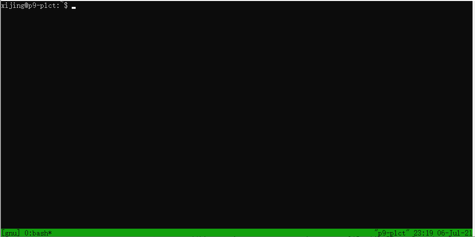
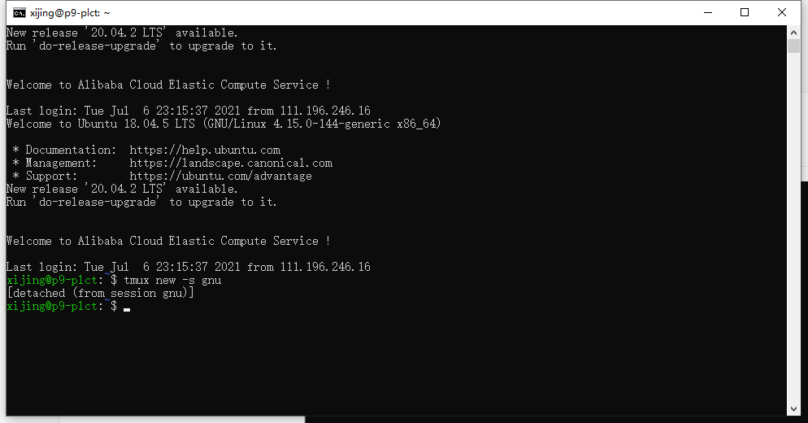
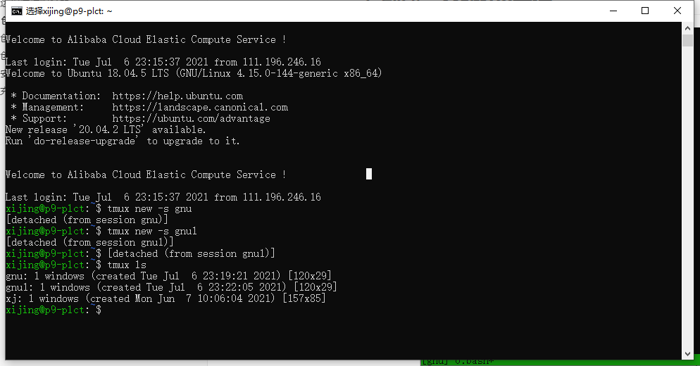

# 搭建docker测试环境

## 1. 口令

1. 创建ssh pubkey作为登录服务器的秘钥

   `ssh-keygen -t rsa -C "xijing@droid.ac.cn"`  其中双引号中的信息随意填写

   将生成的id_rsa.pub打开，复制文件中的内容粘贴到github网页ssh配置处；（人工规定的管理流程：默认将gitlab的秘钥作为服务器的秘钥）

   

2. 申请服务器P9（外网服务器）的权限。

   需要说明的是，我们的代码主要都在github上，而且很大。在进行git clone操作时，由于网络不稳定是非常容易出问题的。在P9上操作可以大大提高成功率。服务器的使用需要@ww申请权限。

   

## 2. 远程连接服务器

在**个人电脑**命令终端上进行如下服务配置操作：

1. 分别拷贝如下信息在命令行执行：(为了安全，下文中的服务器IP隐藏了，请联系管理员获取)

   ```
   cat >> $HOME/.ssh/config <<"EOT"
   Host p8
   HostName ***.**.***.**
   Port 22
   User xijing
   EOT
   ```

   ```
   cat >> $HOME/.ssh/config <<"EOT"
   Host p9
   HostName **.**.**.**
   Port 22
   User xijing
   EOT
   ```

   命令行执行效果：

   ```
   # 执行服务器P8配置
   xj@xj-ThinkPad-T470p:~/.ssh$ cat >> $HOME/.ssh/config <<"EOT"
   > Host p8
   > HostName ***.**.***.**
   > Port 22
   > User xijing
   > EOT
   
   # 执行服务器P9配置
   xj@xj-ThinkPad-T470p:~/.ssh$ cat >> $HOME/.ssh/config <<"EOT"
   > Host p9
   > HostName **.**.**.**
   > Port 22
   > User xijing
   > EOT
   ```

   

2. 检查和测试

   ```
   # 检查配置信息写入是否成功
   xj@xj-ThinkPad-T470p:~/.ssh$ cat config
   Host p8
   HostName ***.**.***.**
   Port 22
   User xijing
   Host p9
   HostName **.**.**.**
   Port 22
   User xijing
   
   # 服务器p8连接测试
   xj@xj-ThinkPad-T470p:~/.ssh$ ssh p8
   
   # 服务器p9连接测试
   xj@xj-ThinkPad-T470p:~/.ssh$ ssh p9
   Welcome to Ubuntu 18.04.5 LTS (GNU/Linux 4.15.0-144-generic x86_64)
   
    * Documentation:  https://help.ubuntu.com
    * Management:     https://landscape.canonical.com
    * Support:        https://ubuntu.com/advantage
   New release '20.04.2 LTS' available.
   Run 'do-release-upgrade' to upgrade to it.
   
   
   Welcome to Alibaba Cloud Elastic Compute Service !
   
   Last login: Tue Jul  6 10:38:25 2021 from 111.196.246.16
   xijing@p9-plct:~$
   ```

   连接成功后，会显示如上p9类似的信息。并且$符号前的信息会变化，请留意。


## 3. 创建一个tmux会话

1. 在ssh之后，第一步先新建一个tmux会话

   ```
   #创建一个会话: tmux new -s <session-name>
   xijing@p9-plct:~$ tmux new -s gnu
   ```

   运行后，直接进入了一个tmux窗口。这里命令行主机名和用户名不变，但是最下面绿色一栏，显示了tmux会话名。说明已经进入了tmux会话窗口。

   

2.  将窗口和会话分离

   在tmux会话窗口执行命令：

   ```
   #将窗口和会话分离: tmux detach
   xijing@p9-plct:~$ tmux detach
   ```

   执行前：

   

   

   执行命令后，回车直接退出到创建tmux会话之前的窗口，并显示`[detached (from session gnu)]`

   

   

   

3. 查询会话

   ```
   #查询会话: tmux ls
   xijing@p9-plct:~$ tmux ls
   gnu1: 1 windows (created Tue Jul  6 23:22:05 2021) [120x29]
   xj: 1 windows (created Mon Jun  7 10:06:04 2021) [157x85]
   ```

   

4. 重新连接（会话和窗口分离）

   ```
   #连接已有的会话: tmux a -t <session-name>
   xijing@p9-plct:~$ tmux a -t gnu
   ```

   连进去后，就可以进行后续操作了。

   

## 4. 创建一个docker容器

由于服务器上有已经安装了docker（root用户创建的），因此无需我们自己去安装docker，直接创建容器并使用就可以了。

请注意：我们ssh远程登录服务器后，默认进入的是自己定义的用户名，所有操作也也在此下进行。

1. 查看本地docker镜像

   ```
   xijing@p9-plct:~$ docker images
   REPOSITORY                        TAG       IMAGE ID       CREATED         SIZE
   ubuntu                            20.04     9873176a8ff5   2 weeks ago     72.7MB
   openroad/flow-scripts             latest    013ac14ba55c   5 weeks ago     2.03GB
   openroad/centos7-builder-gcc      latest    fc815f2a03c8   5 weeks ago     2.89GB
   openroad/yosys                    latest    ed39fb7f7804   5 weeks ago     2.49GB
   <none>                            <none>    7841a9fe650d   2 months ago    13.2GB
   ubuntu                            latest    7e0aa2d69a15   2 months ago    72.7MB
   ubuntu                            <none>    26b77e58432b   3 months ago    72.9MB
   ubuntu                            18.04     3339fde08fc3   3 months ago    63.3MB
   openroad/centos7-dev              latest    ad0fb3601143   3 months ago    1.51GB
   hello-world                       latest    d1165f221234   4 months ago    13.3kB
   centos                            centos7   8652b9f0cb4c   7 months ago    204MB
   ```

   

2. 创建一个本地路径，用于挂载容器目录

   本步骤的目的是为了后续实现宿主机和docker目录共享，方便将测试结果等拷贝出来。

   ```
   xijing@p9-plct:~$ mkdir dockershare
   xijing@p9-plct:~$ ll
   total 64
   drwxr-x--- 10 xijing xijing 4096 Jul  6 22:31 ./
   drwxr-xr-x 25 root   root   4096 Jul  6 22:20 ../
   -rw-------  1 xijing xijing 6958 Jul  5 17:14 .bash_history
   -rw-r--r--  1 xijing xijing  220 May 25 10:51 .bash_logout
   -rw-r--r--  1 xijing xijing 3771 May 25 10:51 .bashrc
   drwx------  2 xijing xijing 4096 May 25 15:12 .cache/
   drwxr-xr-x  3 root   root   4096 May 27 16:24 dock/
   drwxrwxr-x  2 xijing xijing 4096 Jul  6 22:31 dockershare/
   
   xijing@p9-plct:~$ cd dockershare/
   xijing@p9-plct:~/dockershare$ pwd
   /home/xijing/dockershare
   ```

   

3. 创建一个ubuntu20.04 docker容器

   docker run创建并运行了docker，并挂载docker下的/usr/Downloads到host的/home/xijing/dockershare下

   ```
   $ docker run -P --expose 80 -v /[宿主机目录]:/[容器目录] -it --name [容器名] ubuntu:20.04 /bin/bash
   ```

   ```
   xijing@p9-plct:~$ docker run -P --expose 80 -v /home/xijing/dockershare:/usr/Downloads  -it --name gnu ubuntu:20.04 /bin/bash
   root@6d592fc325bf:/#
   ```

   注意：请注意docker run之后，$之前的主机和用户变化了，说明现在已经在docker的ubuntu系统的root用户下了。

   

   检查下挂载的目录/usr/Downloads是否存在：

   ```
   root@6d592fc325bf:/# cd usr
   root@6d592fc325bf:/usr# ll
   total 64
   drwxr-xr-x  1 root root  4096 Jul  6 14:34 ./
   drwxr-xr-x  1 root root  4096 Jul  6 14:34 ../
   drwxrwxr-x  2 1009 1009  4096 Jul  6 14:31 Downloads/
   drwxr-xr-x  2 root root 12288 Jun  9 07:31 bin/
   drwxr-xr-x  2 root root  4096 Apr 15  2020 games/
   drwxr-xr-x  2 root root  4096 Apr 15  2020 include/
   drwxr-xr-x 14 root root  4096 Jun  9 07:31 lib/
   drwxr-xr-x  2 root root  4096 Jun  9 07:27 lib32/
   drwxr-xr-x  2 root root  4096 Jun  9 07:31 lib64/
   drwxr-xr-x  2 root root  4096 Jun  9 07:27 libx32/
   drwxr-xr-x 10 root root  4096 Jun  9 07:27 local/
   drwxr-xr-x  2 root root  4096 Jun  9 07:31 sbin/
   drwxr-xr-x 33 root root  4096 Jun  9 07:27 share/
   drwxr-xr-x  2 root root  4096 Apr 15  2020 src/
   root@6d592fc325bf:/usr#
   ```

   

## 5. 创建用户并授权

1. 在docker root用户下新建普通用户

   docker容器内的root和宿主机的root属于同一个用户，两者的UID均为0。因此虽然在docker容器中，我们还是需要新建普通用户，并使用普通用户来执行所有测试操作。 

   `adduser YOUR-USER-NAME`  #YOUR-USER-NAME代表自定义的用户名
   
```
   # 新建一个xj用户
   root@6d592fc325bf:~# adduser xj
   Adding user `xj' ...
   Adding new group `xj' (1000) ...
   Adding new user `xj' (1000) with group `xj' ...
   Creating home directory `/home/xj' ...
   Copying files from `/etc/skel' ...
   New password:
   Retype new password:
   passwd: password updated successfully
   Changing the user information for xj
   Enter the new value, or press ENTER for the default
           Full Name []:
           Room Number []:
           Work Phone []:
           Home Phone []:
           Other []:
   Is the information correct? [Y/n] y
   root@6d592fc325bf:~#
```


2. 安装sudo

   ```
   # 更新apt源
   root@6d592fc325bf:~# apt update
   Get:1 http://security.ubuntu.com/ubuntu focal-security InRelease [114 kB]
   Get:2 http://archive.ubuntu.com/ubuntu focal InRelease [265 kB]
   Get:3 http://security.ubuntu.com/ubuntu focal-security/universe amd64 Packages [778 kB]
   Get:4 http://security.ubuntu.com/ubuntu focal-security/restricted amd64 Packages [368 kB]
   Get:5 http://security.ubuntu.com/ubuntu focal-security/main amd64 Packages [925 kB]
   Get:6 http://security.ubuntu.com/ubuntu focal-security/multiverse amd64 Packages [27.6 kB]
   Get:7 http://archive.ubuntu.com/ubuntu focal-updates InRelease [114 kB]
   Get:8 http://archive.ubuntu.com/ubuntu focal-backports InRelease [101 kB]
   Get:9 http://archive.ubuntu.com/ubuntu focal/universe amd64 Packages [11.3 MB]
   Get:10 http://archive.ubuntu.com/ubuntu focal/main amd64 Packages [1275 kB]
   Get:11 http://archive.ubuntu.com/ubuntu focal/restricted amd64 Packages [33.4 kB]
   Get:12 http://archive.ubuntu.com/ubuntu focal/multiverse amd64 Packages [177 kB]
   Get:13 http://archive.ubuntu.com/ubuntu focal-updates/universe amd64 Packages [1040 kB]
   Get:14 http://archive.ubuntu.com/ubuntu focal-updates/multiverse amd64 Packages [32.0 kB]
   Get:15 http://archive.ubuntu.com/ubuntu focal-updates/restricted amd64 Packages [416 kB]
   Get:16 http://archive.ubuntu.com/ubuntu focal-updates/main amd64 Packages [1361 kB]
   Get:17 http://archive.ubuntu.com/ubuntu focal-backports/universe amd64 Packages [6315 B]
   Get:18 http://archive.ubuntu.com/ubuntu focal-backports/main amd64 Packages [2668 B]
   Fetched 18.4 MB in 3s (5781 kB/s)
   Reading package lists... Done
   Building dependency tree
   Reading state information... Done
   11 packages can be upgraded. Run 'apt list --upgradable' to see them.

   # 安装sudo
   root@6d592fc325bf:~# apt install sudo
   Reading package lists... Done
   Building dependency tree
   Reading state information... Done
   The following NEW packages will be installed:
     sudo
   0 upgraded, 1 newly installed, 0 to remove and 11 not upgraded.
   Need to get 514 kB of archives.
   After this operation, 2257 kB of additional disk space will be used.
   Get:1 http://archive.ubuntu.com/ubuntu focal-updates/main amd64 sudo amd64 1.8.31-1ubuntu1.2 [514 kB]
   Fetched 514 kB in 1s (476 kB/s)
   debconf: delaying package configuration, since apt-utils is not installed
   Selecting previously unselected package sudo.
   (Reading database ... 4127 files and directories currently installed.)
   Preparing to unpack .../sudo_1.8.31-1ubuntu1.2_amd64.deb ...
   Unpacking sudo (1.8.31-1ubuntu1.2) ...
   Setting up sudo (1.8.31-1ubuntu1.2) ...
   root@6d592fc325bf:~#
   ```

   

3. 为普通用户添加sudo权限

   在/etc/sudoers中添加一行`YOUR-USER-NAME     ALL=(ALL:ALL) ALL`

   ```
   # 安装vim
   root@6d592fc325bf:~# apt install vim

   root@6d592fc325bf:/# vim /etc/sudoers

   # 检查修改是否保存
   root@6d592fc325bf:/# cat /etc/sudoers
   #
   # This file MUST be edited with the 'visudo' command as root.
   #
   # Please consider adding local content in /etc/sudoers.d/ instead of
   # directly modifying this file.
   #
   # See the man page for details on how to write a sudoers file.
   #
   Defaults        env_reset
   Defaults        mail_badpass
   Defaults        secure_path="/usr/local/sbin:/usr/local/bin:/usr/sbin:/usr/bin:/sbin:/bin:/snap/bin"

   # Host alias specification

   # User alias specification

   # Cmnd alias specification

   # User privilege specification
   root    ALL=(ALL:ALL) ALL
   xj    ALL=(ALL:ALL) ALL

   # Members of the admin group may gain root privileges
   %admin ALL=(ALL) ALL

   # Allow members of group sudo to execute any command
   %sudo   ALL=(ALL:ALL) ALL

   # See sudoers(5) for more information on "#include" directives:

   #includedir /etc/sudoers.d
   root@6d592fc325bf:/#
   ```

​		

4. 切换到普通用户下

   ```
   root@6d592fc325bf:/# su xj
   To run a command as administrator (user "root"), use "sudo <command>".
   See "man sudo_root" for details.

   xj@6d592fc325bf:/$
   ```

   注意观察$前的用户和主机信息。已经切换到普通用户xj下了。

   


## 补充说明

1. 当容器被创建后，后续连接容器方法如下：

```
   # 查看所有容器
   xijing@p9-plct:~$ docker ps -a
   CONTAINER ID   IMAGE                   COMMAND          CREATED       STATUS                    PORTS                                     NAMES
   5b32a647536e   ubuntu:20.04            "/bin/bash"      3 days ago    Exited (0) 2 days ago                                               opencv
   e2ba8bd04169   ubuntu:20.04            "/bin/bash"      9 days ago    Exited (137) 2 days ago                                             testxx
   3392b5dadf41   ubuntu:20.04            "-name opencv"   10 days ago   Created                   0.0.0.0:50000->22/tcp, :::50000->22/tcp   upbeat_johnson

   # 发现容器未启动，启动容器
   xijing@p9-plct:~$ docker restart testxx
   testxx

   # 查看正在运行的容器
   xijing@p9-plct:~$ docker ps
   CONTAINER ID   IMAGE          COMMAND       CREATED      STATUS         PORTS                                     NAMES
   e2ba8bd04169   ubuntu:20.04   "/bin/bash"   9 days ago   Up 6 seconds   0.0.0.0:49153->80/tcp, :::49153->80/tcp   testxx

   # 连接已经正在运行的容器
   xijing@p9-plct:~$ docker attach testxx
```


2. 为普通用户添加sudo权限

   ```
   切换到root用户下：
   sudo visudo
   # User privilege specification
   root ALL=(ALL:ALL) ALL
   YOUR-USER-NAME ALL=(ALL:ALL) ALL
   ctrl+O 保存修改——》回车——》ctrl+X退出
   ```

   

3. tmux窗口和会话分离的状态下，每次只要窗口关闭或者网络问题导致窗口退出，就可以执行以下步骤重连继续：

   ```
   #ssh连接服务器
   ssh p9

   #连接已有的会话
   tmux a -t <session-name>
   ```

   tmux窗口使用`exit`可以退出会话。会话将删除不继续存在。
   
   
   
4. 

